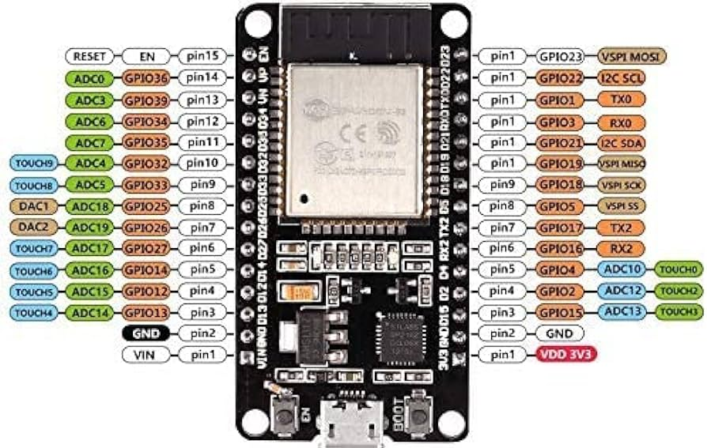

ESP32-WROOM-32 Specification: https://www.espressif.com/sites/default/files/documentation/esp32-wroom-32_datasheet_en.pdf

The DM332T Drivers require a 5V signal, which is powered through the ESP's `VIN` (5V) pin. It is crucial that no other power sources are connected to this node when in operation as it can blow the power regulation circuits in the ESP board.

# Connections and tested behaviors

- ESP32 `VIN` connected to DM332T `OPTO` (5V power)
- ESP32 `pin8` connected to DM332T `PUL` (PWM signal to control motor turn speed)
- DM332T `DIR` floating -> sets `DIR` default to `LOW`. 
- 